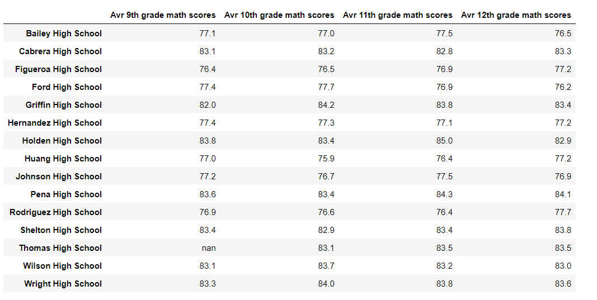

# School District Analysis (School_District_Analysis)

## Overview 
The purpose of this assignment is to use Jupyter notebook, python, pandas library, learning about activating/deactivating development environment using anaconda and creating documents that contain live code.
School district raw data contains information about students, grades, schools, school size, budget and school success categories. Data has some irregularity and need to be inspected and cleaned at first. Later using datasets we gather lot of information about the school and students, using conditionals, sliced data, grouped data into categories. Tjos assignment also teaches Panda data types, series and DataFrames which allows us to use built-in methods and visualize School District data quickly and manipulate data easily.

## Results
- How is the district summary affected?
The school district summary gives us a high-level snapshot of the district's key metrics on;
Total number of students
Total number of schools
Total budget
Average math score
Average reading score
Percentage of students who passed math
Percentage of students who passed reading
Overall passing percentage
The following pictures shows us the difference on the percentage of student who passed reading, math and overall passing. According to the summary after cleaning and removing NaN values from the database where 9th graders at St.Thomas, the percentages change because the number of students in gr 9 in St Thomas schools have changed, 461 less students in calculations. the Total student # changed from 39170 to 38709. This effects the district summary on the reading, math and overal percentages.

- How is the school summary affected?
The school summary requires us to get the following key metrics for each school and place them in a school summary DataFrame. We needed the following key metrics to create the school summary:
School name
School type
Total students
Total school budget
Per student budget
Average math score
Average reading score
% passing math
% passing reading
% overall passing
The following pictures show us the difference on the percentages of students who passed reading, math and overall passing. According to the school summary the percentages for St Thomas HS changes and increases reading, math and overal percentage from 60's to 90's for that school.

- How does replacing the ninth graders’ math and reading scores affect Thomas High School’s performance relative to the other schools?
Relative to the other schools St. Thomas HS percentages increase to 90's and becomes the second highest top school.
- How does replacing the ninth-grade scores affect the following:
 - Math and reading scores by grade
It affects the St Thomas HS and lowers the average math and reading scores when we replace grade 9 math and reading scores with NaN. Other schools are not affected. Ave math was 83.418349, reading was 83.848930 before replacing the 9th grade score. Math scores of Thomas HS gr 10-12 are not effected. 

 
  - Scores by school spending
scores by school spending is not effected as seen below. Thomas HS is still a medium size school. 
Bailey High School       628.0
Cabrera High School      582.0
Figueroa High School     639.0
Ford High School         644.0
Griffin High School      625.0
Hernandez High School    652.0
Holden High School       581.0
Huang High School        655.0
Johnson High School      650.0
Pena High School         609.0
Rodriguez High School    637.0
Shelton High School      600.0
Thomas High School       638.0
Wilson High School       578.0
Wright High School       583.0

 - Scores by school size
scores by school size is as seen in the image below. Thomas HS is in the 1000-2000 school size. Changing the 9th grade math and reading to NaN does not effect the # of students or the school size.

 - Scores by school type
Changing the gr 9 math, reading values for Thomas HS does not affect the scores by school type, Thomas HS is still a charter school. The image below shows the data relates to school type and scores.

## Summary

Summarize four changes in the updated school district analysis after reading and math scores for the ninth grade at Thomas High School have been replaced with NaNs.
- Number of rows were 39170 and went down to 38709
- passing math percentage changed from 74.98 to 74.8 percent
- passing reading percentage changed from 85.80 to 85.7 percent
- Overal percentage changed from 65.17 to 64.9 percent
